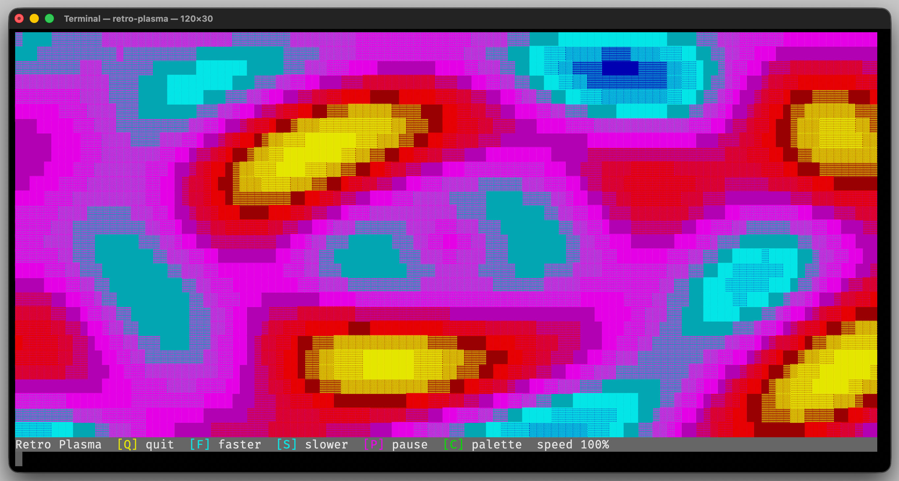

..
    Copyright (c) 2026 Tobias Erbsland - Erbsland DEV. https://erbsland.dev
    SPDX-License-Identifier: Apache-2.0

*****
Input
*****

The input classes provide access to keyboard input from the terminal.
They are designed for interactive applications such as dashboards, tools, and terminal games that need immediate key
handling.
For text prompts that still need cursor movement, editing, history, or masked input,
:cpp:class:`cterm::ReadLine <erbsland::cterm::ReadLine>` provides a complete interactive editor.

Usage
=====

Polling for Keys in a Redraw Loop
---------------------------------

For interactive applications, switch the input backend to key mode and poll for input with a timeout.
This allows your application to update the screen regularly while still reacting to keyboard events.

.. code-block:: cpp

    using namespace std::chrono_literals;

    terminal.input().setMode(Input::Mode::Key);
    auto quitRequested = false;

    while (!quitRequested) {
        if (const auto key = terminal.input().readKey(90ms); key.valid()) {
            if (key == U'q') {
                quitRequested = true;
            } else if (key == Key::Left) {
                // Move selection.
            }
        }
    }

Using a timeout keeps the redraw loop responsive without busy waiting.
In key mode, ``readKey(0ms)`` and any negative timeout perform a non-blocking poll.
Use ``waitForKey()`` when you intentionally want to block until the next key arrives.
The older ``read()`` wrapper is deprecated and now forwards to either ``readKey()`` or ``waitForKey()``.

Switching Between Key and Line Input
------------------------------------

``Input::Mode`` controls whether the terminal reads raw key presses or full lines of text.
``Mode::Key`` is the right choice for interactive applications with a redraw loop, while ``Mode::ReadLine`` fits
prompts, configuration tools, and simple command-driven interfaces.

.. code-block:: cpp

    terminal.input().setMode(Input::Mode::ReadLine);
    terminal.print("Name: ");
    const auto name = terminal.input().readLine();

    terminal.input().setMode(Input::Mode::Key);
    terminal.printLine("Press any key to continue...");
    const auto key = terminal.input().waitForKey();

Switching modes on the same terminal makes it easy to combine menu-driven screens with occasional free-form text input.

Reading Editable Text
---------------------

Create :cpp:class:`cterm::ReadLine <erbsland::cterm::ReadLine>` with a shared terminal and a copy of
:cpp:class:`cterm::ReadLineOptions <erbsland::cterm::ReadLineOptions>`.
The blocking interface starts the editor, waits for a terminal result, restores the input mode, and then returns.

.. code-block:: cpp

    auto options = ReadLineOptions{}
        .setTitle("Enter your name:")
        .setPadding(block::MarginPair{1, 2})
        .setMaximumLength(CpLength{100})
        .setPlaceholder("Your Name");
    auto readLine = ReadLine::create(terminal, options);

    const auto result = readLine->waitForInput();
    if (result.isCommitted()) {
        useName(result.data());
    } else if (result.isCancelled()) {
        handleCancellation();
    } else if (result.isTimeout()) {
        handleTimeout();
    }

Pressing :cpp:enumerator:`cterm::Key::Enter` commits the text, while
:cpp:enumerator:`cterm::Key::Escape` cancels the operation.
Only a committed result is successful and contains text.
Cancellation, timeout, and idle results always contain an empty string.

Polling an Editor
-----------------

Use ``start()``, ``update()``, and ``stop()`` when the surrounding application has its own update loop.
An idle result means that the editor remains active but no terminal result is available yet.
Committed, cancelled, and timeout results remain latched until ``stop()``.

.. code-block:: cpp

    auto readLine = ReadLine::create(terminal, options);
    readLine->start();

    while (true) {
        updateApplicationState();

        const auto result = readLine->update();
        if (!result.isIdle()) {
            if (result.isCommitted()) {
                processCommand(result.data());
            }
            break;
        }
    }

    readLine->stop();

``ReadLine`` requires an interactive terminal in full-control output mode.
Starting an editor on an unsupported terminal raises :cpp:class:`err::RuntimeError <erbsland::err::RuntimeError>`.
The editor saves the previous input mode, switches to key mode, and restores the saved mode when it stops.
While active, it exclusively owns the terminal output area; do not print unrelated terminal output from the application.

Editing and Multiple Lines
--------------------------

Text is inserted at the rendered cursor.
The arrow keys move through wrapped and explicit lines, Home and End move within the current visual row, Backspace
removes the editable unit before the cursor, and Delete removes the unit below it.
Unicode combining sequences are edited and displayed as one unit, while ``maximumLength`` is measured in code points.

Set ``maximumLines`` above one to enable logical line breaks.
The default new-line key is :cpp:enumerator:`cterm::Key::F2`, which avoids platform-dependent control-key decoding.
It has no effect with the default one-line limit.

.. code-block:: cpp

    auto options = ReadLineOptions{}
        .setTitle("Release notes")
        .setMaximumLines(LineCount{8})
        .setMaximumDisplayLines(LineCount{4});

    auto readLine = ReadLine::create(terminal, options);
    const auto result = readLine->waitForInput(); // F2 inserts a line break.

Long logical lines wrap at the available width.
Continuation rows align with the beginning of the editable text after prompt and padding.
When the editor grows beyond ``maximumDisplayLines``, it scrolls its edit rows to keep the cursor visible.
The layout is recalculated after a terminal resize.

History and Draft Text
----------------------

Pass a :cpp:type:`text::StringList <erbsland::text::StringList>` to ``setHistory()`` to provide earlier values.
Up selects older history at the first visual row and Down selects newer history at the last visual row.
Moving beyond the newest entry restores the draft that was active before history navigation.
Non-empty committed text is appended to the editor's reusable history, except for consecutive duplicates.

``setCurrentText()`` initializes the draft.
Current text and history are copied by ``ReadLine::create()`` and truncated to the earliest configured code-point or
logical-line limit, independent of the order in which the option setters were called.

Secrets and Placeholders
------------------------

A placeholder is visible only while the edit buffer is empty.
Use :cpp:class:`ReadSecret <erbsland::cterm::ReadSecret>` for passwords or tokens.
Ordinary ``ReadLine`` always displays entered text.
``ReadSecret`` stores at most 1024 Unicode code points in a fixed buffer, renders only bullets, and returns a marked
:cpp:type:`String <erbsland::text::String>` in the ordinary ``ReadLineResult``.
It shares terminal lifecycle, key dispatch, layout, and rendering with ``ReadLine``, while protecting its fixed input
storage and marking committed UTF-8 before exposing it.

.. code-block:: cpp

    auto options = ReadLineOptions{}
        .setTitle("Access token")
        .setPlaceholder("Paste token");

    auto token = ReadSecret::create(terminal, options)->waitForInput();
    if (token.isCommitted()) {
        useToken(token.data()); // marked String
    }

Secret input is always one logical and display line.
History and current text are rejected, the new-line binding is unused, and requested lengths above 1024 are clamped.
Left, Right, Home, End, Backspace, Delete, Unicode combined input, cancellation, timeout, blocking, and polling
lifecycles behave like the corresponding single-line editor.
Entering and leaving the editor purges pending backend key state.

The fixed application buffer and protected result reduce recoverable process-memory remnants, but do not erase kernel or
terminal-driver queues and do not prevent swapping, crash dumps, register remnants, or process compromise.

Layouts and Cleanup
-------------------

:cpp:enum:`cterm::ReadLineDisplayStyle <erbsland::cterm::ReadLineDisplayStyle>` provides four adaptive layouts:

.. code-block:: text

    Compact             HorizontalSpace
    <title>             <title>
    <prompt> █          <prompt> █

    HorizontalFrame                     Frame
    ─── <title> ────────────────         ┌─ <title> ──────────────┐
    <prompt> █                           │<prompt> █               │
    ────────────────────────────         └────────────────────────┘

The input area uses the configured background, title, prompt, placeholder, text, cursor, border, and horizontal padding.
The padding is a :cpp:class:`block::MarginPair <erbsland::block::MarginPair>` whose leading and trailing values are
clamped to zero or greater.
The cursor is rendered into this area and blinks without moving the physical terminal cursor.
Whenever editing, navigation, or history selection actually moves the cursor, the blink cycle restarts in its visible
phase.
This keeps the cursor visible while it is being positioned.

With cleanup enabled, ``stop()`` clears every row the editor occupied and returns to the original position.
With cleanup disabled, it leaves the final area visible without its caret and places the terminal cursor at the
beginning of the next line.
``stop()`` is idempotent, and destruction safely stops an active editor.

Inactivity Timeout
------------------

Set a positive timeout to end the operation after that many seconds without recognized editing or navigation input.
Recognized edit, navigation, and history keys reset the timer even when the cursor or a configured limit prevents a
change.
Ignored keys and cursor blink updates do not reset it.

``timeoutDisplayThreshold`` controls when the title begins displaying the remaining time as ceiling whole seconds.
The default threshold is 20 seconds.
For example, a 60-second timeout remains hidden until the countdown reaches ``20s``.
Set the threshold to zero to disable the countdown display.
If the configured timeout is at or below the threshold, the countdown is visible immediately.

The displayed form is appended to the title, for example ``Enter value [12s]``.
If the title is empty, the countdown is displayed on its own.
The blocking editor waits only until the next input, blink, countdown, or timeout event, so it does not busy-wait.

Describing Key Bindings
-----------------------

``InputDefinition`` represents a key binding together with the input mode it applies to.
It is useful when describing configurable shortcuts or when displaying the currently active bindings.

.. code-block:: cpp

    auto quitKey = InputDefinition{Key{Key::Character, U'q'}, InputDefinition::ForMode::Key};
    auto helpKey = InputDefinition{Key{Key::F1}, InputDefinition::ForMode::Key};

    std::cout << "Quit: " << quitKey.toDisplayText() << "\n";
    std::cout << "Help: " << helpKey.toString() << "\n";

The helper functions ``toDisplayText()`` and ``toString()`` make it easy to present key bindings in help screens or
configuration output.

For interactive tools with one command bound to several keys, use ``Keys``.
It stores unique key presses in priority order, can test whether a decoded key is part of the set, and can separate main
keys from alternatives for compact and detailed help.

Special keys may carry modifiers such as ``shift+up``, ``ctrl+pageup``, or ``alt+f4``.
Modified keys are distinct from their unmodified base key, so a binding for ``up`` does not also match ``shift+up``.
Printable text input remains text input: pressing Shift with a letter produces the resulting character, for example
``Q``.

Matching Decoded Key Types
--------------------------

When you only care about the general kind of a key event, inspect ``Key::Type`` instead of comparing against a long list
of individual keys.
For character comparisons, prefer Unicode code points such as ``U'q'`` and use ``Key::unicode()`` or ``Key::combined()``
instead of the deprecated ASCII accessor.
Character comparisons match the exact decoded code point, so compare against the exact character you want to handle.

.. code-block:: cpp

    using namespace std::chrono_literals;

    if (const auto key = terminal.input().readKey(50ms); key.valid()) {
        if (key.type() == Key::Character || key.type() == Key::Combined) {
            terminal.printLine("Typed: ", BlockString{key.combined()});
        } else if (key.type() == Key::Escape) {
            terminal.printLine("Leaving key mode.");
        }
    }

This is especially handy when the application wants to distinguish between text entry, navigation keys, and control keys
before it decides how to handle the event.

    The animated demos use ``Input`` in key mode so screen redraws and
    keyboard handling remain responsive.
